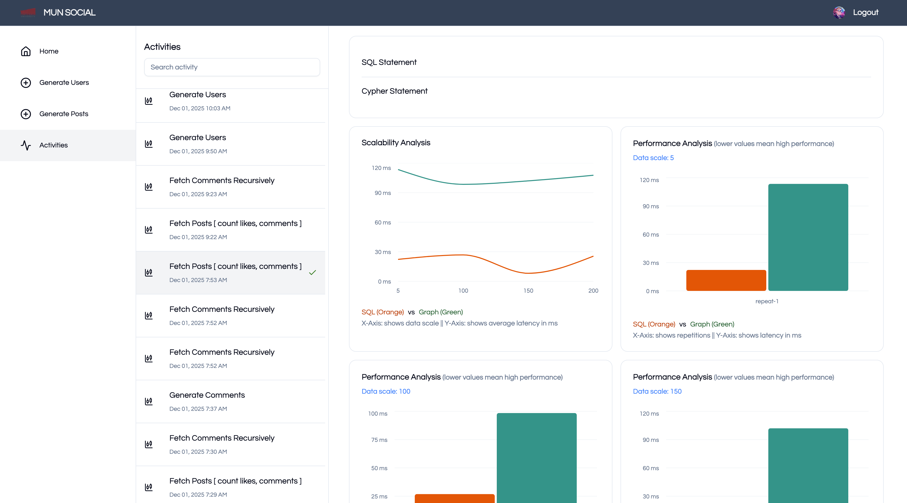

# Relational vs Graph Database Performance Benchmarking
### SQLite vs Neo4j using Social-Network Workloads

This project is a controlled experimental environment built to compare the performance characteristics of a **relational database (SQLite)** and a **graph database (Neo4j)**.  
Rather than functioning as a typical software application, the system exists to:

- Generate realistic social-network data
- Execute equivalent operations on both SQLite and Neo4j
- Measure execution time, scalability behaviour, and query cost
- Observe how each database handles relationship-heavy workloads

The goal is to understand *where relational databases perform well*, *where graph databases outperform them*, and *how data structure influences query complexity and runtime*.

---





---

## Project Purpose

Relational and graph databases are optimized for different workloads:

| Relational (SQLite) | Graph (Neo4j) |
|---------------------|----------------|
| Tables, foreign keys | Nodes + relationships |
| Joins required for traversal | Direct edge traversal |
| Strong consistency, structured schema | Optimized for connected data |
| Great for transactional workloads | Great for social graphs, recursion, recommendations |

This project evaluates those differences by executing **realistic social-network operations** against both systems.

---

## Setting up the prject
```bash
npm install
npm run build
npm run start
```

---

## Social-Network Dataset Generation

To test deep traversal and relationship-dense operations, the experiment generates:

### **Users**
- Thousands of users
- Shared between SQL and Graph DB using a consistent `identifier`

### **Posts**
- Each user may create multiple posts
- Stored in `posts` table and in Neo4j as `(:Post)` nodes

### **Followers / Following**
- SQL: many-to-many join table
- Neo4j: `(:User)-[:FOLLOWS]->(:User)`

### **Likes**
- SQL: rows in `post_likes`
- Neo4j: `(:User)-[:LIKED]->(:Post)`

### **Nested Comments (Recursive)**
Comments are generated in multiple depth levels:

Comment Level 0
└─ Reply Level 1
└─ Reply Level 2
└─ Reply Level 3

This workload stresses:

- SQL recursive CTE performance
- Neo4j variable-length path traversal (`*1..n`)

---

## Benchmark Workloads

All operations are executed with identical parameters on both engines and logged with a shared correlation ID.

### **1. User Generation**
Ensures both systems contain identical user datasets.

### **2. Post Creation**
Measures baseline write performance.

### **3. Creating Followers**
Tests many-to-many relationship creation:
- SQL: insert rows into `followers`
- Graph: merge `[:FOLLOWS]` edges

### **4. Creating Likes**
For each post:
- SQLite inserts rows
- Neo4j creates relationships with `MERGE`

Evaluates uniqueness checks and write amplification.

### **5. Creating Deep Nested Comments**
The most complex write workload:
- SQL inserts with parent references
- Neo4j creates nodes plus `[:REPLY_TO]` chains

Evaluates recursive write performance.

### **6. Fetching Comments Recursively**
Reads full comment trees:
- SQL: recursive CTE
- Neo4j: graph traversal

Key test for hierarchical data retrieval.

### **7. Fetching Posts With Aggregations**
Counts:
- Likes
- Comments
- Followers and following
- Creator information

Measures aggregation and fan-out behaviour.

---

## Metrics Collected

For every experiment run:

- Latency (ms)
- Scalability across dataset size
- Warm vs cold cache behaviour
- Query text (SQL + Cypher)
- Run repetition number
- Dataset scale
- Engine used (SQLite or Neo4j)

All results are stored, visualized, and can be compared across runs.

---

logs every experiment run

The structure is designed around **data generation → execution → logging → analysis**.

---

## What This Project Demonstrates

This benchmarking environment helps answer:

- When does SQLite outperform Neo4j?
- When does Neo4j outperform SQLite?
- What happens as relationship density increases?
- How do both engines behave with deep recursion?
- How do writes scale as datasets grow?
- What are the costs of joins vs graph traversal?

These questions are investigated using workloads typical of:

- social networks
- messaging systems
- comment trees
- follower graphs
- recommendation engines

---

## Running the Experiments

1. Generate users
2. Generate posts
3. Run any of the benchmark suites:
    - Generate Followers
    - Generate Likes
    - Generate Comments
    - Fetch Comments Recursively
    - Fetch Posts (aggregations)

Each run logs performance metrics for later analysis.

---

## Summary

This project is a **database comparison study**, not a traditional software platform.  
Its purpose is to evaluate:

- Relational modeling vs graph modeling
- Query performance under different workloads
- Behaviour of both engines at scale
- Costs of recursion, joins, and traversal
- Real-world applicability of each engine to connected data problems

SQLite and Neo4j each have strengths—this environment makes those strengths measurable and comparable.

---
